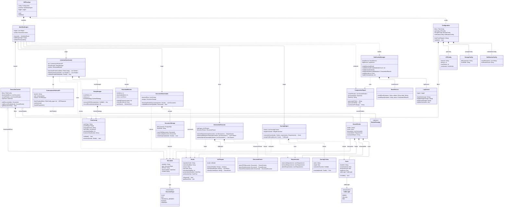

```mermaid
---
config:
  layout: elk
---
classDiagram
    class W2FlowApp {
        -config: Configuration
        -workflow: WorkflowEngine
        -logger: Logger
        +run()
        +initialize()
    }

    class WorkflowEngine {
        -stages: List~Stage~
        -context: ExecutionContext
        +execute(): WorkflowResult
        +addStage(stage: Stage)
        +validatePrerequisites()
    }

    class ExecutionContext {
        -filters: FilterConfig
        -downloadedDocs: List~Document~
        -scoredTenders: List~ScoredTender~
        -startTime: DateTime
        +addDocument(doc: Document)
        +addScoredTender(tender: ScoredTender)
        +getExecutionTime(): float
    }

    class FilterConfig {
        -workType: String
        -priceRange: Range
        -geographicArea: String
        -cpvCodes: List~String~
        -executionDeadline: int
        -businessClassification: String
        +validate(): bool
        +matches(tender: Tender): bool
    }

    class LicitationDownloader {
        -api: ContractacioPublicaAPI
        -retryManager: RetryManager
        -monitor: DownloadMonitor
        +downloadTenderList(filters: FilterConfig): List~Tender~
        +filterNewTenders(tenders: List~Tender~): List~Tender~
        +validateTenderDate(tender: Tender): bool
    }

    class ContractacioPublicaAPI {
        -baseUrl: String
        -auth: Authentication
        -session: HTTPSession
        +fetchTenders(filters: FilterConfig, page: int): APIResponse
        +authenticate()
        +handlePagination()
    }

    class RetryManager {
        -maxRetries: int
        -timeout: int
        -backoffStrategy: BackoffStrategy
        +executeWithRetry(operation: Callable): Any
        +recordRetryAttempt(attempt: int)
    }

    class DownloadMonitor {
        -totalItems: int
        -downloadedItems: int
        -errors: List~Error~
        +updateProgress(current: int)
        +recordError(error: Error)
        +getStatus(): MonitorStatus
    }

    class DocumentDownloader {
        -requiredDocs: List~String~
        -storage: DocumentStorage
        +downloadTenderDocuments(tender: Tender): List~Document~
        +validateDocumentType(doc: Document): bool
    }

    class DocumentStorage {
        -dbConnection: PostgreSQL
        -localPath: String
        +saveToDB(document: Document)
        +saveLocally(document: Document)
        +checkDuplicate(tender: Tender): bool
    }

    class Document {
        -tenderId: String
        -type: DocumentType
        -filePath: String
        -downloadDate: DateTime
        -content: binary
    }

    class DocumentType {
        <<enumeration>>
        PCAP
        PPT
        TECHNICAL_MEMORY
        BUDGET
        ANNEXES
    }

    class Tender {
        -expedientCode: String
        -contractingBody: String
        -amount: float
        -cpvCode: String
        -executionDeadline: int
        -presentationDeadline: DateTime
        -publicationDate: DateTime
        +isExpired(): bool
        +getBasicInfo(): dict
    }

    class InformationExtractor {
        -nlpEngine: NLPEngine
        -documentParser: DocumentParser
        +extractRequirements(documents: List~Document~): Requirements
        +extractAdjudicationCriteria(documents: List~Document~): List~Criteria~
        +extractSpecialClauses(documents: List~Document~): List~Clause~
    }

    class NLPEngine {
        -model: AIModel
        +analyzeText(text: String): Analysis
        +extractEntities(text: String): List~Entity~
        +classifyContent(text: String): Classification
    }

    class DocumentParser {
        +parsePDF(document: Document): ParsedContent
        +parseText(document: Document): ParsedContent
        +extractStructure(document: Document): DocumentStructure
    }

    class Requirements {
        -solvencyRequirements: List~Requirement~
        -technicalRequirements: List~Requirement~
        -adminRequirements: List~Requirement~
    }

    class ScoringEngine {
        -criteria: List~ScoringCriteria~
        -weightCalculator: WeightCalculator
        +calculateScore(tender: Tender, requirements: Requirements): Score
        +assignTrafficLight(score: Score): TrafficLight
    }

    class ScoringCriteria {
        -name: String
        -weight: float
        -evaluationFunction: Callable
        +evaluate(tender: Tender): float
    }

    class Score {
        -tenderId: String
        -economicScore: float
        -technicalScore: float
        -totalScore: float
        -trafficLight: TrafficLight
        +isViable(): bool
    }

    class TrafficLight {
        <<enumeration>>
        GREEN
        YELLOW
        RED
    }

    class ScoredTender {
        -tender: Tender
        -score: Score
        -documents: List~Document~
        -extractedInfo: Requirements
        -evaluationReport: String
    }

    class ComparativeReport {
        -scoredTenders: List~ScoredTender~
        -generationDate: DateTime
        -summary: String
        +generateHTML(): String
        +generateJSON(): dict
        +summarizeFindings(): String
    }

    class NotificationManager {
        -emailService: EmailService
        -logService: LogService
        +notifyDownloadStart()
        +notifyDownloadComplete(tenderCount: int)
        +notifyEvaluationStart()
        +notifyEvaluationComplete(report: ComparativeReport)
        +notifyError(error: Error)
        +notifyTimeout(retries: int)
    }

    class EmailService {
        +sendEmail(recipient: String, subject: String, body: String)
        +sendReport(recipient: String, report: ComparativeReport)
    }

    class LogService {
        -logger: Logger
        +logInfo(message: String)
        +logWarning(message: String)
        +logError(message: String)
        +logMetrics(metrics: dict)
    }

    class Configuration {
        -filters: FilterConfig
        -apiConfig: APIConfig
        -storageConfig: StorageConfig
        -notificationConfig: NotificationConfig
        +loadFromFile(path: String)
        +validate(): bool
    }

    class APIConfig {
        -baseUrl: String
        -timeout: int
        -maxRetries: int
        -credentials: Credentials
    }

    class StorageConfig {
        -dbConnection: String
        -localPath: String
    }

    class NotificationConfig {
        -emailRecipients: List~String~
        -notificationLevel: String
    }

    class BackoffStrategy {
        <<abstract>>
    }

    %% ── Relaciones ──────────────────────────────────────────────

    %% W2FlowApp
    W2FlowApp *-- Configuration : config
    W2FlowApp *-- WorkflowEngine : workflow

    %% WorkflowEngine orquesta las etapas del pipeline (RF-01 → RF-07)
    WorkflowEngine *-- ExecutionContext : context
    WorkflowEngine --> LicitationDownloader : stage
    WorkflowEngine --> DocumentDownloader : stage
    WorkflowEngine --> InformationExtractor : stage
    WorkflowEngine --> ScoringEngine : stage
    WorkflowEngine ..> ComparativeReport : produces
    WorkflowEngine ..> NotificationManager : notifies

    %% ExecutionContext acumula datos de ejecución
    ExecutionContext *-- FilterConfig : filters
    ExecutionContext "1" o-- "*" Document : downloadedDocs
    ExecutionContext "1" o-- "*" ScoredTender : scoredTenders

    %% Configuration compone subconfigs (R-05)
    Configuration *-- FilterConfig : filters
    Configuration *-- APIConfig : apiConfig
    Configuration *-- StorageConfig : storageConfig
    Configuration *-- NotificationConfig : notificationConfig

    %% LicitationDownloader — RF-01, RF-02
    LicitationDownloader *-- ContractacioPublicaAPI : api
    LicitationDownloader *-- RetryManager : retryManager
    LicitationDownloader *-- DownloadMonitor : monitor
    LicitationDownloader ..> FilterConfig : uses
    LicitationDownloader ..> Tender : returns

    %% ContractacioPublicaAPI usa FilterConfig para paginar (RF-01)
    ContractacioPublicaAPI ..> FilterConfig : fetchTenders

    %% RetryManager — RNF-02, R-04
    RetryManager *-- BackoffStrategy : backoffStrategy

    %% DocumentDownloader — RF-04, RN-02
    DocumentDownloader *-- DocumentStorage : storage
    DocumentDownloader ..> Tender : processes
    DocumentDownloader ..> Document : returns

    %% DocumentStorage persiste documentos (R-07)
    DocumentStorage ..> Document : persists

    %% Document tiene tipo enumerado
    Document --> DocumentType : type

    %% InformationExtractor — RF-05
    InformationExtractor *-- NLPEngine : nlpEngine
    InformationExtractor *-- DocumentParser : documentParser
    InformationExtractor ..> Document : reads
    InformationExtractor ..> Requirements : returns

    %% ScoringEngine — RF-06, RN-03
    ScoringEngine "1" *-- "*" ScoringCriteria : criteria
    ScoringEngine ..> Tender : evaluates
    ScoringEngine ..> Requirements : uses
    ScoringEngine ..> Score : returns

    %% Score lleva semáforo (RN-03)
    Score --> TrafficLight : trafficLight

    %% ScoredTender agrega resultado completo
    ScoredTender *-- Tender : tender
    ScoredTender *-- Score : score
    ScoredTender "1" o-- "*" Document : documents
    ScoredTender *-- Requirements : extractedInfo

    %% ComparativeReport — RF-07
    ComparativeReport "1" o-- "*" ScoredTender : scoredTenders

    %% NotificationManager — RNF-02, RNF-03, RNF-04
    NotificationManager *-- EmailService : emailService
    NotificationManager *-- LogService : logService
    NotificationManager ..> ComparativeReport : uses
```
