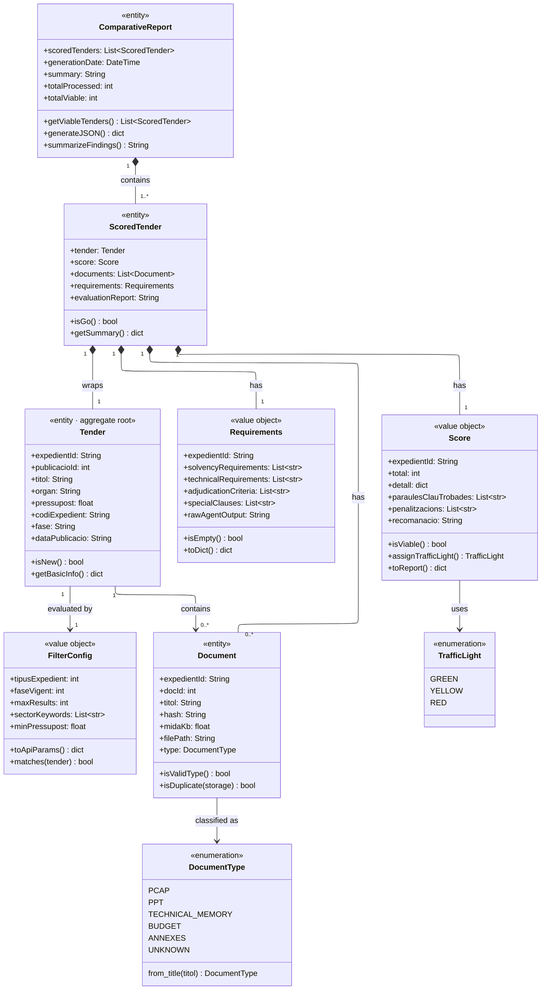

```mermaid
---
config:
  layout: elk
---
classDiagram
    class Tender {
        <<entity · aggregate root>>
        +expedientId: String
        +publicacioId: int
        +titol: String
        +organ: String
        +pressupost: float
        +codiExpedient: String
        +fase: String
        +dataPublicacio: String
        +isNew() bool
        +getBasicInfo() dict
    }

    class FilterConfig {
        <<value object>>
        +tipusExpedient: int
        +faseVigent: int
        +maxResults: int
        +sectorKeywords: List~str~
        +minPressupost: float
        +toApiParams() dict
        +matches(tender) bool
    }

    class Document {
        <<entity>>
        +expedientId: String
        +docId: int
        +titol: String
        +hash: String
        +midaKb: float
        +filePath: String
        +type: DocumentType
        +isValidType() bool
        +isDuplicate(storage) bool
    }

    class DocumentType {
        <<enumeration>>
        PCAP
        PPT
        TECHNICAL_MEMORY
        BUDGET
        ANNEXES
        UNKNOWN
        from_title(titol) DocumentType
    }

    class Requirements {
        <<value object>>
        +expedientId: String
        +solvencyRequirements: List~str~
        +technicalRequirements: List~str~
        +adjudicationCriteria: List~str~
        +specialClauses: List~str~
        +rawAgentOutput: String
        +isEmpty() bool
        +toDict() dict
    }

    class Score {
        <<value object>>
        +expedientId: String
        +total: int
        +detall: dict
        +paraulesClauTrobades: List~str~
        +penalitzacions: List~str~
        +recomanacio: String
        +isViable() bool
        +assignTrafficLight() TrafficLight
        +toReport() dict
    }

    class TrafficLight {
        <<enumeration>>
        GREEN
        YELLOW
        RED
    }

    class ScoredTender {
        <<entity>>
        +tender: Tender
        +score: Score
        +documents: List~Document~
        +requirements: Requirements
        +evaluationReport: String
        +isGo() bool
        +getSummary() dict
    }

    class ComparativeReport {
        <<entity>>
        +scoredTenders: List~ScoredTender~
        +generationDate: DateTime
        +summary: String
        +totalProcessed: int
        +totalViable: int
        +getViableTenders() List~ScoredTender~
        +generateJSON() dict
        +summarizeFindings() String
    }

    Tender "1" --> "0..*" Document : contains
    Tender "1" --> "1" FilterConfig : evaluated by
    Document --> DocumentType : classified as
    Score --> TrafficLight : uses
    ScoredTender "1" *-- "1" Tender : wraps
    ScoredTender "1" *-- "1" Score : has
    ScoredTender "1" *-- "0..*" Document : has
    ScoredTender "1" *-- "1" Requirements : has
    ComparativeReport "1" *-- "1..*" ScoredTender : contains
```
