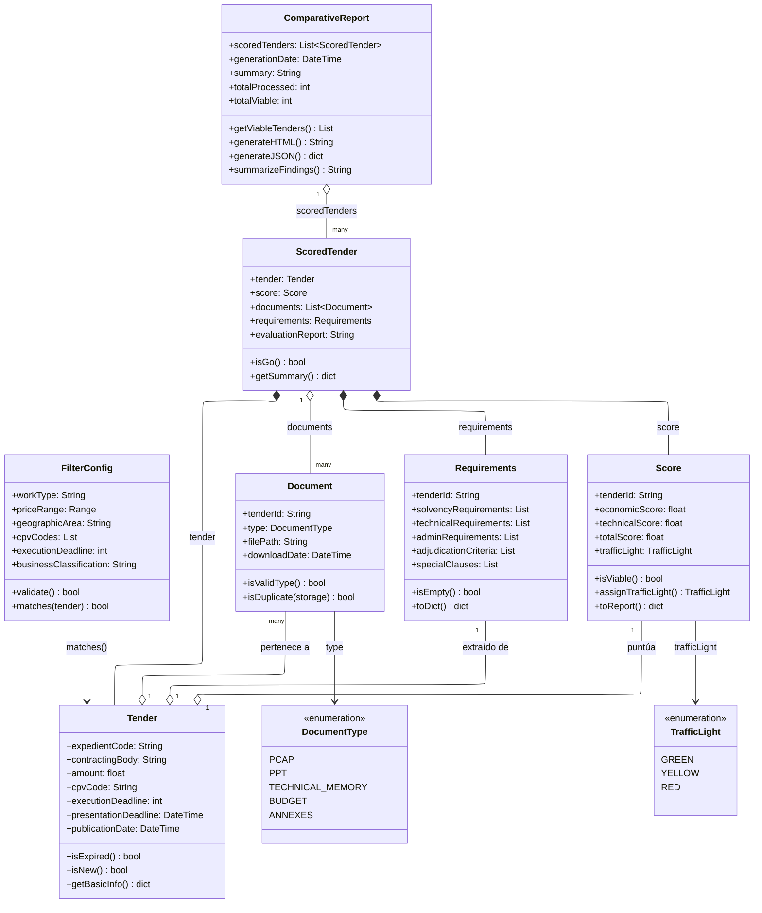

```mermaid
---
config:
  layout: elk
---
classDiagram
    class Tender {
        +expedientCode: String
        +contractingBody: String
        +amount: float
        +cpvCode: String
        +executionDeadline: int
        +presentationDeadline: DateTime
        +publicationDate: DateTime
        +isExpired() bool
        +isNew() bool
        +getBasicInfo() dict
    }

    class FilterConfig {
        +workType: String
        +priceRange: Range
        +geographicArea: String
        +cpvCodes: List
        +executionDeadline: int
        +businessClassification: String
        +validate() bool
        +matches(tender) bool
    }

    class Document {
        +tenderId: String
        +type: DocumentType
        +filePath: String
        +downloadDate: DateTime
        +isValidType() bool
        +isDuplicate(storage) bool
    }

    class DocumentType {
        <<enumeration>>
        PCAP
        PPT
        TECHNICAL_MEMORY
        BUDGET
        ANNEXES
    }

    class Requirements {
        +tenderId: String
        +solvencyRequirements: List
        +technicalRequirements: List
        +adminRequirements: List
        +adjudicationCriteria: List
        +specialClauses: List
        +isEmpty() bool
        +toDict() dict
    }

    class Score {
        +tenderId: String
        +economicScore: float
        +technicalScore: float
        +totalScore: float
        +trafficLight: TrafficLight
        +isViable() bool
        +assignTrafficLight() TrafficLight
        +toReport() dict
    }

    class TrafficLight {
        <<enumeration>>
        GREEN
        YELLOW
        RED
    }

    class ScoredTender {
        +tender: Tender
        +score: Score
        +documents: List~Document~
        +requirements: Requirements
        +evaluationReport: String
        +isGo() bool
        +getSummary() dict
    }

    class ComparativeReport {
        +scoredTenders: List~ScoredTender~
        +generationDate: DateTime
        +summary: String
        +totalProcessed: int
        +totalViable: int
        +getViableTenders() List
        +generateHTML() String
        +generateJSON() dict
        +summarizeFindings() String
    }

    %% Relaciones
    FilterConfig ..> Tender : matches()

    Document --> DocumentType : type
    Document "many" --o "1" Tender : pertenece a

    Requirements "1" --o "1" Tender : extraído de

    Score --> TrafficLight : trafficLight
    Score "1" --o "1" Tender : puntúa

    ScoredTender *-- Tender : tender
    ScoredTender *-- Score : score
    ScoredTender *-- Requirements : requirements
    ScoredTender "1" o-- "many" Document : documents

    ComparativeReport "1" o-- "many" ScoredTender : scoredTenders
```
