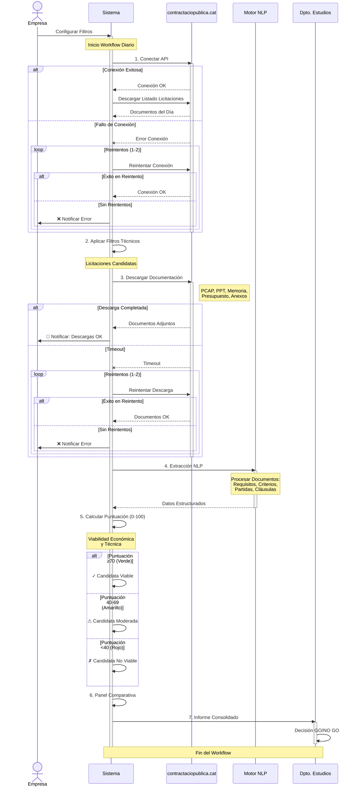

```mermaid
sequenceDiagram

    actor Empresa
    participant Sistema
    participant API as contractaciopublica.cat
    participant Procesador as Motor NLP
    participant Departamento as Dpto. Estudios

    Empresa->>Sistema: Configurar Filtros
    activate Sistema
    
    Note over Sistema: Inicio Workflow Diario
    Sistema->>API: 1. Conectar API
    activate API
    
    alt Conexión Exitosa
        API-->>Sistema: Conexión OK
        Sistema->>API: Descargar Listado Licitaciones
        API-->>Sistema: Documentos del Día
    else Fallo de Conexión
        API--xSistema: Error Conexión
        loop Reintentos (1-2)
            Sistema->>API: Reintentar Conexión
            alt Éxito en Reintento
                API-->>Sistema: Conexión OK
            else Sin Reintentos
                Sistema->>Empresa: ❌ Notificar Error
            end
        end
    end
    deactivate API
    
    Sistema->>Sistema: 2. Aplicar Filtros Técnicos
    Note over Sistema: Licitaciones Candidatas
    
    Sistema->>API: 3. Descargar Documentación
    activate API
    Note right of API: PCAP, PPT, Memoria,<br/>Presupuesto, Anexos
    
    alt Descarga Completada
        API-->>Sistema: Documentos Adjuntos
        Sistema->>Empresa: 📢 Notificar: Descargas OK
    else Timeout
        API--xSistema: Timeout
        loop Reintentos (1-2)
            Sistema->>API: Reintentar Descarga
            alt Éxito en Reintento
                API-->>Sistema: Documentos OK
            else Sin Reintentos
                Sistema->>Empresa: ❌ Notificar Error
            end
        end
    end
    deactivate API
    
    Sistema->>Procesador: 4. Extracción NLP
    activate Procesador
    Note over Procesador: Procesar Documentos:<br/>Requisitos, Criterios,<br/>Partidas, Cláusulas
    Procesador-->>Sistema: Datos Estructurados
    deactivate Procesador
    
    Sistema->>Sistema: 5. Calcular Puntuación (0-100)
    Note over Sistema: Viabilidad Económica<br/>y Técnica
    
    alt Puntuación ≥70 (Verde)
        Sistema->>Sistema: ✓ Candidata Viable
    else Puntuación 40-69 (Amarillo)
        Sistema->>Sistema: ⚠ Candidata Moderada
    else Puntuación <40 (Rojo)
        Sistema->>Sistema: ✗ Candidata No Viable
    end
    
    Sistema->>Sistema: 6. Panel Comparativa
    Sistema->>Departamento: 7. Informe Consolidado
    activate Departamento
    Departamento->>Departamento: Decisión GO/NO GO
    deactivate Departamento
    
    Note over Sistema,Departamento: Fin del Workflow
    deactivate Sistema
```