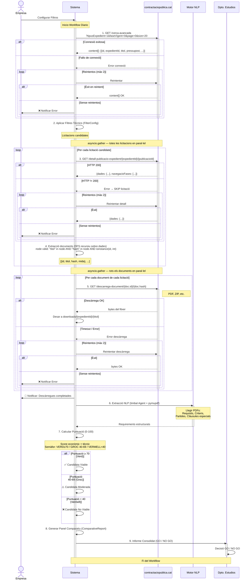

```mermaid
sequenceDiagram

    actor Empresa
    participant Sistema
    participant API as contractaciopublica.cat
    participant Procesador as Motor NLP
    participant Departamento as Dpto. Estudios

    Empresa->>Sistema: Configurar Filtros
    activate Sistema

    Note over Sistema: Inicio Workflow Diario

    %% ─── PAS 1: CERCA DE LICITACIONS ────────────────────────────────
    Sistema->>API: 1. GET /cerca-avancada<br/>?tipusExpedient=1&faseVigent=0&page=0&size=20
    activate API

    alt Connexió exitosa
        API-->>Sistema: content[]: [{id, expedientId, titol, pressupost, ...}]
    else Fallo de connexió
        API--xSistema: Error connexió
        loop Reintentos (màx 2)
            Sistema->>API: Reintentar
            alt Èxit en reintent
                API-->>Sistema: content[] OK
            else Sense reintentos
                Sistema->>Empresa: ❌ Notificar Error
            end
        end
    end
    deactivate API

    Sistema->>Sistema: 2. Aplicar Filtres Tècnics (FilterConfig)
    Note over Sistema: Licitacions candidates

    %% ─── PAS 3: DETALL PER CADA LICITACIÓ (paral·lel) ──────────────
    Note over Sistema,API: asyncio.gather — totes les licitacions en paral·lel
    loop Per cada licitació candidate
        Sistema->>API: 3. GET /detall-publicacio-expedient/{expedientId}/{publicacioId}
        activate API
        alt HTTP 200
            API-->>Sistema: {dades: {...}, navegacioFases: [...]}
        else HTTP != 200
            API--xSistema: Error → SKIP licitació
            loop Reintentos (màx 2)
                Sistema->>API: Reintentar detall
                alt Èxit
                    API-->>Sistema: {dades: {...}}
                else Sense reintentos
                    Sistema->>Empresa: ❌ Notificar Error
                end
            end
        end
        deactivate API

        Sistema->>Sistema: 4. Extracció documents (DFS recursiu sobre dades)<br/>node vàlid: "titol" in node AND "hash" in node AND isinstance(id, int)
        Note over Sistema: [{id, titol, hash, mida}, ...]
    end

    %% ─── PAS 5: DESCÀRREGA DOCUMENTS (paral·lel) ───────────────────
    Note over Sistema,API: asyncio.gather — tots els documents en paral·lel
    loop Per cada document de cada licitació
        Sistema->>API: 5. GET /descarrega-document/{doc.id}/{doc.hash}
        activate API
        Note right of API: PDF, ZIP, etc.
        alt Descàrrega OK
            API-->>Sistema: bytes del fitxer
            Sistema->>Sistema: Desar a downloads/{expedientId}/{titol}
        else Timeout / Error
            API--xSistema: Error descàrrega
            loop Reintentos (màx 2)
                Sistema->>API: Reintentar descàrrega
                alt Èxit
                    API-->>Sistema: bytes OK
                else Sense reintentos
                    Sistema->>Empresa: ❌ Notificar Error
                end
            end
        end
        deactivate API
    end

    Sistema->>Empresa: 📢 Notificar: Descàrregues completades

    %% ─── PAS 6: NLP + SCORING ───────────────────────────────────────
    Sistema->>Procesador: 6. Extracció NLP (timbal Agent + pymupdf)
    activate Procesador
    Note over Procesador: Llegir PDFs:<br/>Requisits, Criteris,<br/>Partides, Clàusules especials
    Procesador-->>Sistema: Requirements estructurats
    deactivate Procesador

    Sistema->>Sistema: 7. Calcular Puntuació (0-100)
    Note over Sistema: Score econòmic + tècnic<br/>Semàfor: VERD≥70 / GROC 40-69 / VERMELL<40

    alt Puntuació ≥ 70 (Verd)
        Sistema->>Sistema: ✅ Candidata Viable
    else Puntuació 40-69 (Groc)
        Sistema->>Sistema: ⚠️ Candidata Moderada
    else Puntuació < 40 (Vermell)
        Sistema->>Sistema: ❌ Candidata No Viable
    end

    %% ─── PAS 8: INFORME I DECISIÓ ───────────────────────────────────
    Sistema->>Sistema: 8. Generar Panel Comparatiu (ComparativeReport)
    Sistema->>Departamento: 9. Informe Consolidat (GO / NO GO)
    activate Departamento
    Departamento->>Departamento: Decisió GO / NO GO
    deactivate Departamento

    Note over Sistema,Departamento: Fi del Workflow
    deactivate Sistema
```
